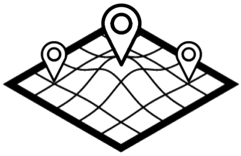

# SmartAgroVisualizationTool
> [Google Summer of Code](https://developers.google.com/open-source/gsoc/) project for **Liquid Galaxy** [organization](https://github.com/LiquidGalaxyLAB).

API public and local servers of Smart Agro Visualization Tool (*SAVT*) project.

SAVT is a web application that creates a friendly non-expert user experience to visualize smart agriculture data grouped in two types (sensors and drone images) and send them to a [Liquid Galaxy](https://github.com/LiquidGalaxy/liquid-galaxy/wiki).



## Getting started

### Installation

#### sensor-api

##### Requirements
To run sensor-api, mongoDB is required. Installation tutorials [here](https://docs.mongodb.com/manual/installation/#mongodb-community-edition).

```shell
git clone git@github.com:calv00/SmartAgroVisualizationTool.git
cd SmartAgroVisualizationTool/sensor-api
npm install
```

#### kml-server

```shell
git clone git@github.com:calv00/SmartAgroVisualizationTool.git
cd SmartAgroVisualizationTool/kml-server
npm install
```

### Usage

#### sensor-api
Inside [sensor-api](https://github.com/calv00/SmartAgroVisualizationTool/tree/master/sensor-api):
```shell
mongod --dbpath ./data/db/
npm start
```

#### kml-server

Inside [kml-server](https://github.com/calv00/SmartAgroVisualizationTool/tree/master/kml-server):
```shell
npm start
```

## Developing

### Built With

- [Node](https://nodejs.org/)
- [npm](https://www.npmjs.com/)
- [Express](http://expressjs.com/)
- [mongoDB](https://www.mongodb.com/)

### Information

#### sensor-api

mongodb database runs on default port 27017. To change the port, execute mongodb run command like:
```
mongod --dbpath ./data/db/ --port PORT_NUMBER
```
being *PORT_NUMBER* the port desired by the user.

sensor-api is configured to run on port 3002. To change the port, the file [sensor-api/bin/www](https://github.com/calv00/SmartAgroVisualizationTool/blob/master/sensor-api/bin/www) has to be modified:
```
...
app.set('port', process.env.PORT || 3002);
...
```

#### kml-server

kml-server is configured to run on port 3003. To change the port, the file [kml-server/bin/www](https://github.com/calv00/SmartAgroVisualizationTool/blob/master/kml-server/bin/www) has to be modified:
```
...
app.set('port', process.env.PORT || 3003);
...
```

## References

SmartAgroVisualizationTool has been created thanks to the code of the projects:
- **navijo**'s [FlOYBD](https://github.com/navijo/FlOYBD)

Readme based on **wearehive**'s [project-guidelines](https://github.com/wearehive/project-guidelines)

### Google Summer of Code
GSOC info explained [here](https://github.com/calv00/SmartAgroVisualizationTool/blob/master/docs/GSOC17.md).

## Issues
Feel free to open an [issue](https://github.com/calv00/SmartAgroVisualizationTool/issues) of any error you find in the project. 

## Licensing

[MIT License](https://github.com/calv00/SmartAgroVisualizationTool/blob/master/LICENSE)

Copyright (c) 2017 Javier Calvo García